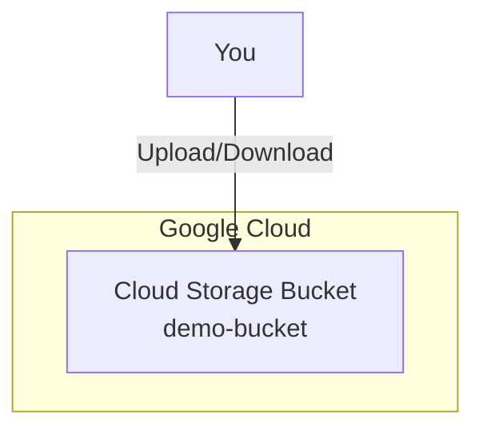

# GCP Demo 1: Cloud Storage Bucket

**Objective:** Create a simple Cloud Storage bucket to store files.

## What You'll Learn
- How to create a GCS bucket with Terraform
- Basic bucket configuration
- How to destroy resources when done

## Architecture



## Prerequisites

```bash
# 1. Install Terraform
brew install terraform

# 2. Install Google Cloud SDK
brew install google-cloud-sdk

# 3. Authenticate with GCP
gcloud auth application-default login

# 4. Set your project
gcloud config set project YOUR_PROJECT_ID
```

## Step-by-Step

### Step 1: Initialize Terraform

```bash
cd demo1-gcs
terraform init
```

### Step 2: Review the Plan

```bash
terraform plan
```

This shows what will be created:
- 1 Cloud Storage bucket
- Location: us-central1

### Step 3: Apply the Changes

```bash
terraform apply
```

Type `yes` when prompted.

### Step 4: Verify the Bucket

```bash
# List your buckets
gsutil ls

# Check bucket details
gsutil ls -L gs://demo-bucket-terraform/
```

### Step 5: Upload a Test File

```bash
echo "Hello from Terraform!" > test.txt
gsutil cp test.txt gs://demo-bucket-terraform/
gsutil ls gs://demo-bucket-terraform/
```

### Step 6: Destroy (Clean Up)

```bash
terraform destroy
```

Type `yes` to confirm.

## Files Explained

| File | Purpose |
|------|---------|
| `main.tf` | Defines the GCS bucket resource |
| `variables.tf` | Configurable options |
| `outputs.tf` | Shows bucket URL after creation |
| `versions.tf` | Terraform version requirements |

## Next Steps

✅ **Completed:** You created a Cloud Storage bucket!

➡️ **Next:** [Demo 2: VPC + Compute Engine](../demo2-vpc-compute/README.md)
