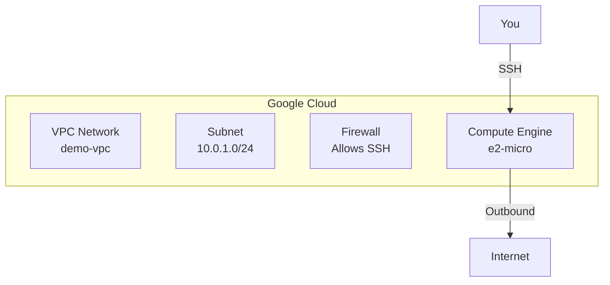

# GCP Demo 2: VPC + Compute Engine

**Objective:** Create a VPC network with a virtual machine (Compute Engine) that can be accessed.

## What You'll Learn
- How to create a GCP VPC network
- How to create a subnet
- How to launch a Compute Engine instance
- How to connect to your instance

## Architecture



## Prerequisites

```bash
# 1. Install Terraform
brew install terraform

# 2. Install Google Cloud SDK
brew install google-cloud-sdk

# 3. Authenticate with GCP
gcloud auth application-default login

# 4. Enable required APIs
gcloud services enable compute.googleapis.com

# 5. Set your project
gcloud config set project YOUR_PROJECT_ID
```

## Step-by-Step

### Step 1: Initialize Terraform

```bash
cd demo2-vpc-compute
terraform init
```

### Step 2: Review the Plan

```bash
terraform plan
```

This shows what will be created:
- 1 VPC Network
- 1 Subnet (10.0.1.0/24)
- 1 Firewall rule (allows SSH)
- 1 Compute Engine instance (e2-micro - free tier)

### Step 3: Apply the Changes

```bash
terraform apply
```

Type `yes` when prompted.

### Step 4: Get the Instance IP

```bash
terraform output
```

Look for `external_ip` in the output.

### Step 5: Connect to Your Instance

```bash
# Use the IP from the output
gcloud compute ssh demo-instance --zone=us-central1-a

# Or via SSH directly
ssh -i ~/.ssh/google_compute_engine <username>@<EXTERNAL_IP>
```

### Step 6: Destroy (Clean Up)

```bash
terraform destroy
```

Type `yes` to confirm.

## Next Steps

✅ **Completed:** You created VPC + Compute Engine!

➡️ **Next:** [Demo 3: GKE Cluster](../demo3-gke/README.md)
