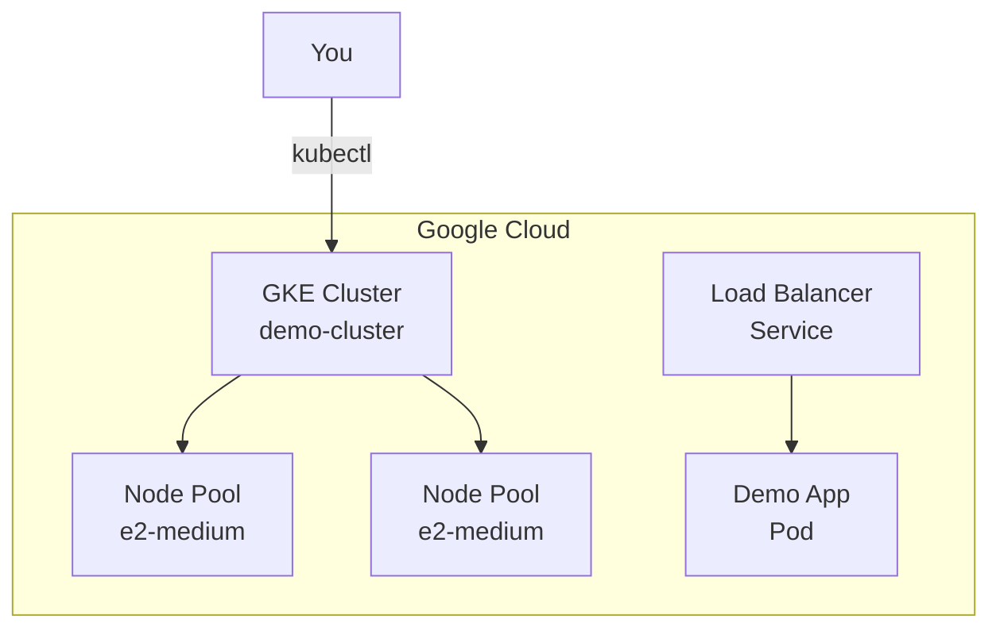

# GCP Demo 3: GKE Cluster

**Objective:** Create a managed Kubernetes cluster (GKE) and deploy a simple application.

## What You'll Learn
- How to create a GKE cluster
- How to configure kubectl to connect to the cluster
- How to deploy a simple application to Kubernetes
- How to clean up resources

## Architecture



## Prerequisites

```bash
# 1. Install Terraform
brew install terraform

# 2. Install Google Cloud SDK
brew install google-cloud-sdk

# 3. Install kubectl
brew install kubectl

# 4. Authenticate with GCP
gcloud auth application-default login

# 5. Enable required APIs
gcloud services enable container.googleapis.com

# 6. Set your project
gcloud config set project YOUR_PROJECT_ID
```

## Step-by-Step

### Step 1: Initialize Terraform

```bash
cd demo3-gke
terraform init
```

### Step 2: Review the Plan

```bash
terraform plan
```

This shows what will be created:
- 1 GKE Cluster (regional)
- 1 Node Pool (2 x e2-medium)
- Required IAM roles

### Step 3: Apply the Changes

```bash
terraform apply
```

Type `yes` when prompted. This takes ~10 minutes!

### Step 4: Configure kubectl

```bash
# Get credentials
gcloud container clusters get-credentials demo-cluster --region us-central1

# Verify connection
kubectl get nodes
```

### Step 5: Deploy a Simple App

```bash
# Create a deployment
kubectl create deployment demo-app --image=nginx --replicas=2

# Expose it as a Load Balancer service
kubectl expose deployment demo-app --port=80 --type=LoadBalancer

# Check the service
kubectl get services
```

Wait a minute for the Load Balancer to provision, then visit the URL!

### Step 6: Clean Up

```bash
# Delete Kubernetes resources
kubectl delete deployment demo-app
kubectl delete service demo-app

# Destroy Terraform resources
terraform destroy
```

Type `yes` to confirm.

## Cost Warning

⚠️ **GKE is not free tier!**
- GKE control plane: ~$0.10/hour
- Nodes: ~$0.04/hour each

Estimated cost: ~$3-5/day. **Remember to destroy when done!**

## Next Steps

✅ **Completed:** You created a GKE cluster!

🎉 **Congratulations!** You've completed all 3 GCP Terraform Demos!
